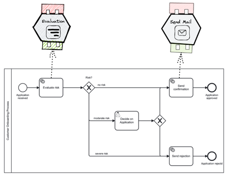
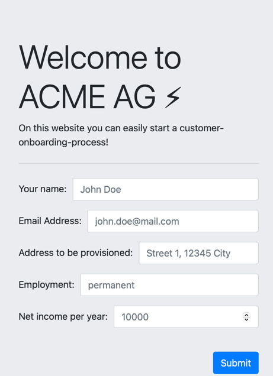

# Customer Onboarding Showcase
This module holds the code for the customer onboarding showcase. It is a showcase of the capabilities of the Miranum Framework 
(IDE as well as Connect) framework. In the figure below you can see the customer onboarding process as well as the integrations
which are written using the Miranum Connect Framework. 

Currently, this showcase only supports Camunda Platform 7 as a process engine. This can be easily changed by migrating the process
diagram for the customer-onboarding project to Camunda Platform 8. 
Before startup, make sure to start the Camunda Platform 7 from the [docker-compose file](./stack/c7/docker-compose.yml) 
which can be found in the stack folder.
To start this showcase build the project and run the following applications: 
* customer-onboarding-mail-c7
* customer-onboarding-starter-c7
* risk-evaluation-c7
* [customer-onboarding-frontend](http://127.0.0.1:5050)

To start a process instance access the customer-onboarding-frontend to fill out the form below.
After filling out the form, the process instance will be started and the process will be executed.

## Miranum-IDE Features
To start modelling processes and designing forms, you need to open the [ressources folder](./resources) in VS Code. 
Make sure to have the [Miranum IDE extensions pack](https://marketplace.visualstudio.com/items?itemName=miragon-gmbh.miranum-ide) 
installed. If you have done so, you can open `*.bpmn` and `*.forms` files to design them. A getting started guide for the IDE
can be found [here](https://miranum.com/docs/guides/getting-started/getting-started-web-ide-guide).

## Miranum-Connect Features
The modules customer-onboarding-starter, customer-onboarding-mail and risk-evaluation are all written using the Miranum Connect Framework.
By doing so the core is platform independent and can run on Camunda 7 as well as 8. It also leverages Domain Driven Design 
principles and a hexagonal architecture.
