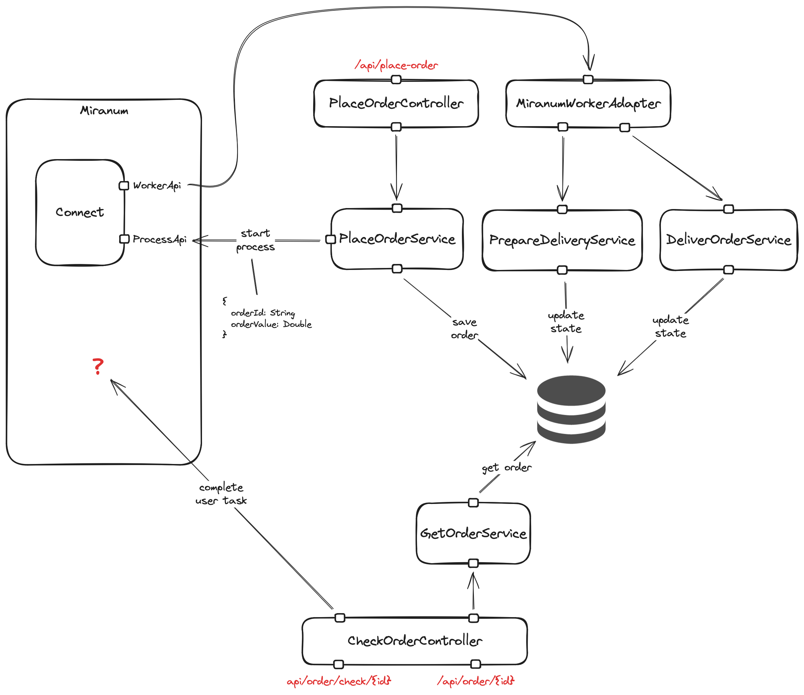
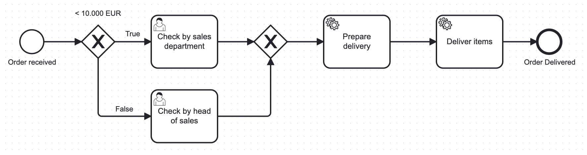

# Miranum Platform Showcase

## Architecture



## Process



### Start process

```json
{
  "customerName": "John Doe",
  "customerAddress": "Main Street 1, London",
  "items": {
    "123": 2,
    "456": 1
  }
}
```

```shell
curl --header "Content-Type: application/json" --request POST --data '{"customerName":"John Doe","customerAddress":"Main Street 1, London","items":{"123":2,"456":1}}' http://localhost:8081/api/place-order
```

### Get tasks

```shell
curl -H "Accept: application/json" http://localhost:8081/api/task
```

### Complete task

```shell
curl --header "Content-Type: application/json" --request POST --data 'true' http://localhost:8081/api/task/complete/960ce524-199a-11ef-b22f-0242ac150002
```
