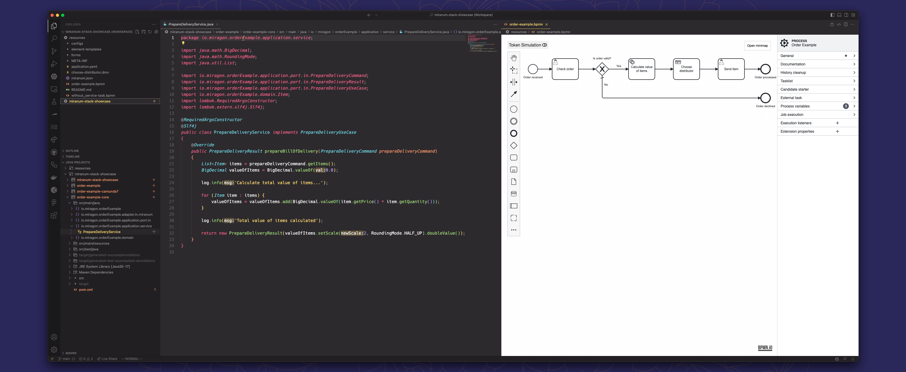

# Miranum Stack Showcase

This Showcase demonstrates our various tools, grouped under the **Miranum** brand.

1. [Miranum Platform](https://github.com/Miragon/miranum-platform)
   is a versatile workflow and process automation framework utilizing components like Camunda 7, a schema-registry and an intuitive task list.
2. [Miranum Connect](https://github.com/Miragon/miranum-connect)
   is a library which enables developers to build reusable and technology neutral connectors and integrations between products.
3. [Miranum IDE](https://github.com/Miragon/miranum-ide)
   provides a centralized hub for editing, managing and accessing process application artifacts via VS Code.

> Note: **Miranum** is still in an early stage of development. As such, there may be some bugs or missing features that will be implemented in the near future.

<p>
   <br>
   <em>A screenshot of an External Task Service next to the BPMN diagram in VS Code.</em>
</p>

## Quick Start

1. Clone this repository
 
   ```bash
   git clone https://github.com/Miragon/miranum-consulting.git
   ```

2. Build Project

   ```bash
   cd miranum-consulting/miranum-stack-showcase/
   mvn clean package
   ```
   
3. Run docker compose

   ```bash
   cd platform-stack
   docker compose --profile engine up
   ```
   
3. Deploy Artifacts (see [here](./docs/deploy-artifacts.md))

4. Open your Browser under `localhost:8081` and login with the following credentials:

   ```text
   user: alex
   password: test
   ```


## Development

With this showcase, we are also going to give you a step-by-step tutorial on how we created it, using only VS Code 
as our IDE.

1. [Set up the Project and Development Environment](./docs/setup-project.md)
2. [Create the **Miranum Worker**](./docs/create-worker.md)
3. [Create the Process Artifacts](./docs/create-process.md)
4. [Test the Process](./docs/test-process.md)
5. [Setup **Miranum Platform**](./docs/setup-miranum-platform.md)
6. [Deploy the Artifacts](./docs/deploy-artifacts.md)
7. [Run the Application](./docs/run-application.md)
8. Open your Browser under `localhost:8081` and login with the following credentials:

   ```text
   user: alex
   password: test
   ```
