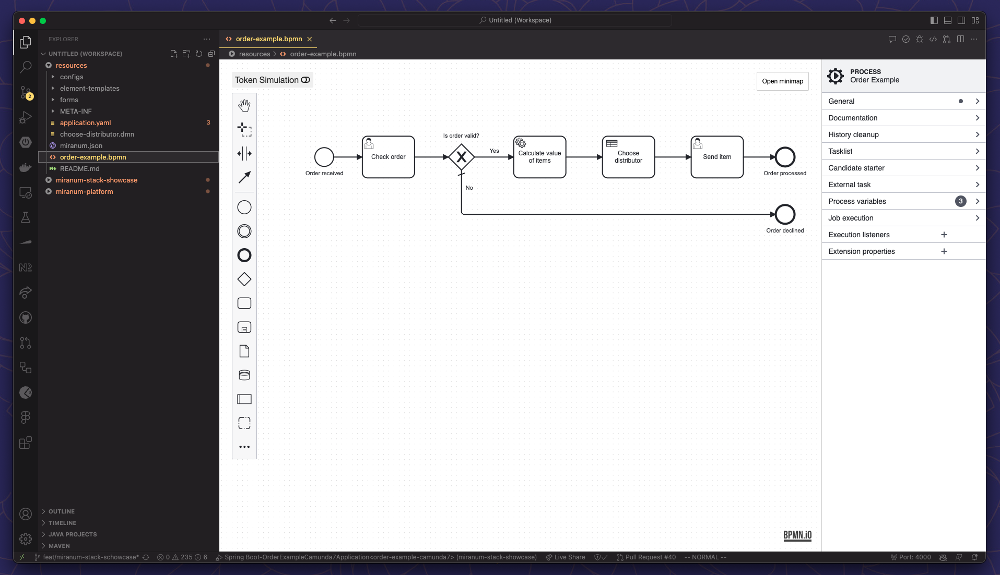
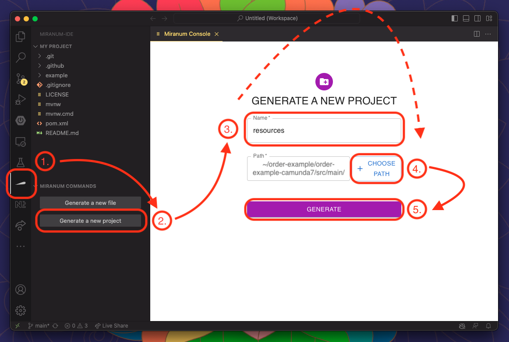
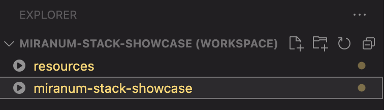
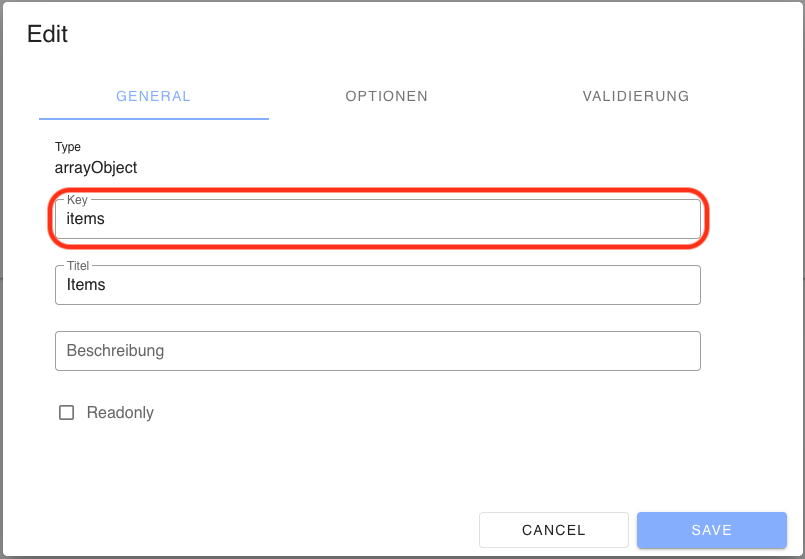
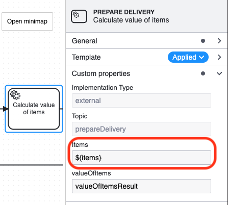
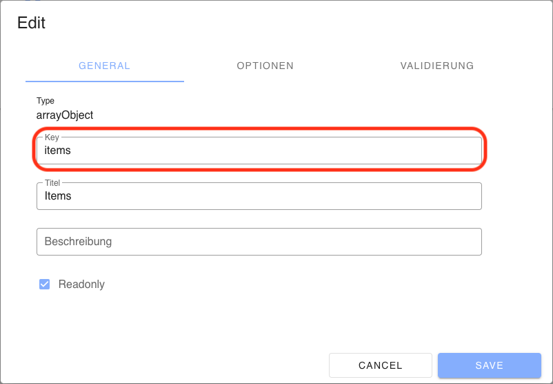
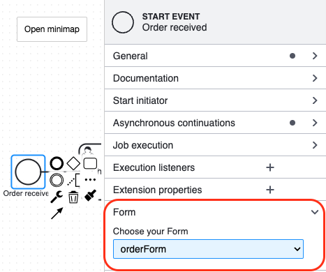
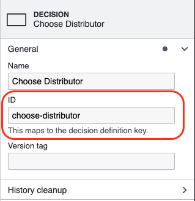
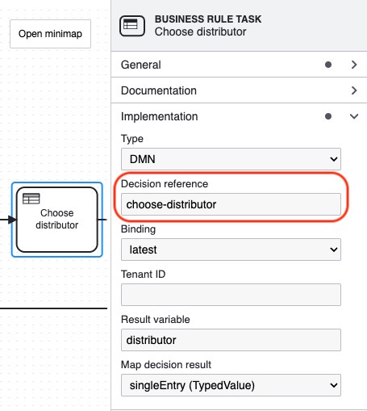

# Create the Process Artifacts

If you followed the steps on [how to set up the development environment](setup-project.md#2-install-vs-code-plugins) you have VS Code with the **Miranum IDE** as a plugin installed.
If not, please do so now.



## 1. Generate the Artifacts

At first, we have to remove the existing resource folder under [`order-example/order-example-camunda7/src/main/resources`](../order-example/order-example-camunda7/src/main/resources)
to add a new `resource` folder by using **Miranum Console**.  
Please follow the instructions in the image below.



This will open the new folder as a workspace.

## 2. *(Optional)* Open the Project as a Second Workspace

> Note: In the current version of the **Miranum IDE** (=0.5.3), it is necessary to open the folder that contains the process artefacts (.bpmn, .dmn, .form, etc.) in a separate workspace.

In VS Code, it is possible to have multiple workspaces open.
This way we can open our project as a second workspace `(File > Add Folder to Workspace...)`.
VS Code will ask you if you want to save this workspace.
You can do this or leave it as an [Untitled Workspace](https://code.visualstudio.com/docs/editor/workspaces#_untitled-multiroot-workspaces).
> Note: For the current version of **Miranum IDE** (=0.5.3) it is important that the workspace/folder with the process artifacts is the first workspace.

The Explorer View should now look like this:



## 3. *(Optional)* Copy the generated Element Templates

If you generated the Element Templates in the [previous step](./create-worker.md#4-optional-generate-element-templates) you can use them in your BPMN Diagram by moving the JSON file(s) to [`/resources/element-templates`](../order-example/order-example-camunda7/src/main/resources/element-templates).

## 4. Create the Process

Rename the generated `BPMN` file to a name of your choice and open it.
This will open our **Miranum Modeler**.
If you are familiar with the Camunda Modeler, you should have no problems navigating.
If not, [here](https://docs.camunda.io/docs/components/modeler/desktop-modeler/model-your-first-diagram/) is a short explanation of the UI-Elements.

### Best Practice (BPMN)

We recommend you to use the so-called *Append-Menu* for a better developing experience.  
This allows you to model pre-configured activities.
You can even add your element templates directly as tasks like shown below.


## 5. Create the Forms

There are already two forms generated inside the [/resources/forms](../order-example/order-example-camunda7/src/main/resources/forms) folder.
Rename the files and open them.
This will open our **Miranum Forms Builder**`.
It is recommended to change the *Form Key* in the top left corner.
Drag and drop the elements you want to create your form.
> Note: Every element has to be inside a *Group*.

### Best Practice (Forms)

Edit the `Key` property of every element you add to your form.
You need the key to access the value of the form field inside your process.

| order.form                                                       | order-example.bpmn                                              | delivery.form                                                       |
|------------------------------------------------------------------|-----------------------------------------------------------------|---------------------------------------------------------------------|
|  |  |  |

To use your form in the process, you have to add it.
You can bind your form to a `Start Event` or `User Task`.
To do this switch back or reopen your `BPMN` file.
Then select the element to which you want to attach the form.
In the *Properties Panel* on the right side you will see an entry called *Form*.
Click on the Dropdown-Menu and select your form.



## 6. Create the Decision Table

Since there is no DMN file in our folder, we have to generate it first.
To do so, we can use **Miranum Console** again like in [Step 1](#1-generate-the-artifacts).
But instead of generating a new project, we will click on `Generate a new file`.
Choose the filename and *DMN* as the type of the file and click on `Generate`.
Now we can open the DMN file and edit it.
[Here](https://docs.camunda.org/get-started/dmn/model/) is a nice tutorial about how to create a DMN Decision Table.

Just like with the forms, we need to attach the decision table to the `Business Rule Task` in our process.

| choose-distributor.dmn                                  | order-example.bpmn                                        |
|---------------------------------------------------------|-----------------------------------------------------------|
|  |  |

## 7. Create a **Miranum Platform** specific config

A special configuration is required for **Miranum Platform** to work properly.
If you look at our process, you will see that we have added an Execution Listener to the Sequence Flow immediately after the Start Event and also to the two End Events.
We will see the effect when we get **Miranum Platform** up and running and start a process instance.
For now, we add the following JSON to a config file under [/resources/configs](../order-example/order-example-camunda7/src/main/resources/configs):

```json
{
  "statusConfig": [
    {
        "key": "offen",
        "label": "Offen",
        "position": 1
    },
    {
        "key": "inBearbeitung",
        "label": "In Bearbeitung",
        "position": 2
    },
    {
        "key": "abgeschlossen",
        "label": "Abgeschlossen",
        "position": 3
    }
  ],
  "configs": []
}
```

## What's next?

To make sure our process makes sense and works, we will test it in the [next step](./test-process.md) as we tested the `Worker`.
