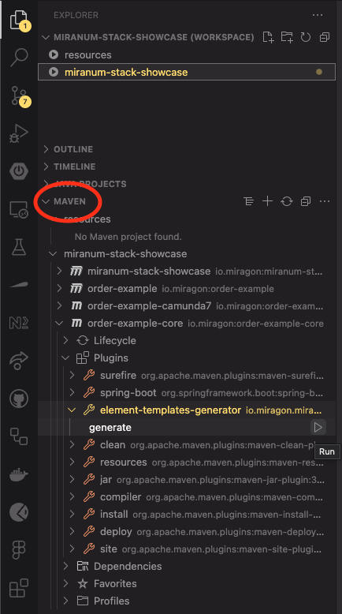

# Create the **Worker**

We use the **Miranum Connect Library** to make our application independent of the engine used.  
There are already many examples that explain how to create a worker, so we will not go into detail here.
If you want to know more about **Miranum Connect** we recommend you to read the [documentation](https://www.miranum.io/docs/guides/quick-start/miranum-connect/miranum-connect-quickstart) or look at some [examples](https://github.com/Miragon/miranum-consulting).

## 1. Create the **Worker**

In the [previous step](./setup-project.md) we use a template to initiate the project.
So the necessary Java classes already exist.
All we have to do is adapt it to suit our own use case.

```java
@RequiredArgsConstructor
public class MiranumWorkerAdapter {

    private final PrepareDeliveryUseCase prepareDeliveryUseCase;

    @Worker(type = "prepareDelivery")
    public PrepareDeliveryResult prepareDelivery(PrepareDeliveryCommand command) {
        return prepareDeliveryUseCase.prepareBillOfDelivery(command);
    }
}
```

[MiranumWorkerAdapter](../order-example/order-example-core/src/main/java/io/miragon/orderExample/adapter/in/miranum/MiranumWorkerAdapter.java)

## 2. Create the Business Logic

The `Service` that contains the business logic is also created from the template.
We are changing the service so that it adds up the given item values and returns the total order amount.

```java
@RequiredArgsConstructor
@Slf4j
public class PrepareDeliveryService implements PrepareDeliveryUseCase
{
    @Override
    public PrepareDeliveryResult prepareBillOfDelivery(PrepareDeliveryCommand prepareDeliveryCommand)
    {
        List<Item> items = prepareDeliveryCommand.getItems();
        BigDecimal valueOfItems = BigDecimal.valueOf(0.0);

        log.info("Calculate total value of items...");

        for (Item item : items) {
            valueOfItems = valueOfItems.add(BigDecimal.valueOf(item.getPrice() * item.getQuantity()));
        }

        log.info("Total value of items calculated");

        return new PrepareDeliveryResult(valueOfItems.setScale(2, RoundingMode.HALF_UP).doubleValue());
    }
}
```

[PrepareDeliveryService](../order-example/order-example-core/src/main/java/io/miragon/orderExample/application/service/PrepareDeliveryService.java)

## 3. Test the Domain Logic

To ensure our service does what we expect, we test it.

```java
@Import(PrepareDeliveryService.class)
@ExtendWith(SpringExtension.class)
public class PrepareDeliveryServiceTest
{
    @Autowired
    private PrepareDeliveryService prepareDeliveryService;

    @Test
    public void shouldAddUpValueOfItems() {
        List<Item> items = Arrays.asList(
                new Item("Soda", 10, 3.99),
                new Item("Chips", 12, 1.79),
                new Item("Chocolate", 2, 2.99));

        Assertions.assertEquals(
                prepareDeliveryService.prepareBillOfDelivery(new PrepareDeliveryCommand(items)).getValueOfItems(),
                67.36);
    }
}
```

[PrepareDeliveryServiceTest](../order-example/order-example-core/src/test/java/io/miragon/orderExample/PrepareDeliveryServiceTest.java)

## 4. **(Optional)** Generate Element Templates

In Step 1 we already defined the input and output of our `Worker`.
Later on, when we create the BPMN Diagram, we have to think about this again.
Element Templates are a great way to pre-configure the interface of the service task.
In this way, we can tell the person who is creating the process what we expect as an input and what he or she will get back from the service task as an output.

To enable this, we have to add a dependency and the **Element-Templates-Generator-Maven-Plugin** from the **Miranum Connect Library**.  
To do that, open the pom.xml under [order-example/order-example-core/pom.xml](../order-example/order-example-core/pom.xml) and add the following:

```xml
<dependencies>
    <!-- ... -->
    <dependency>
        <groupId>io.miragon.miranum</groupId>
        <artifactId>element-template-api</artifactId>
        <version>${miranum.version}</version>
    </dependency>
    <!-- ... -->
</dependencies>

<build>
    <plugins>
        <!-- ... -->
        <plugin>
            <groupId>io.miragon.miranum</groupId>
            <artifactId>element-templates-generator-maven-plugin</artifactId>
            <configuration>
                <targetPlatforms>camunda7</targetPlatforms>
            </configuration>
        </plugin>
        <!-- ... -->
    </plugins>
</build>
```

Now we have to add annotations to the Worker and the class we pass to the Worker as a parameter.

```java
@Worker(type = "prepareDelivery")
@ElementTemplate(name = "Prepare Delivery", description = "Prepare the bill of delivery.")
public PrepareDeliveryResult prepareDelivery(PrepareDeliveryCommand command) {
    return prepareDeliveryUseCase.prepareBillOfDelivery(command);
}
```

[MiranumWorkerAdapter](../order-example/order-example-core/src/main/java/io/miragon/orderExample/adapter/in/miranum/MiranumWorkerAdapter.java)

```java
public class PrepareDeliveryCommand
{
    @ElementTemplateProperty(type = PropertyType.STRING, label = "Items", notEmpty = true, editable = true)
    private List<Item> items;
}
```

[PrepareDeliveryCommand](../order-example/order-example-core/src/main/java/io/miragon/orderExample/application/port/in/PrepareDeliveryCommand.java)

To execute the plugin, expand the *Maven*-Menu in VS Code and click on *generate*.
> Note: This requires the Plugin listed [here](./setup-project.md#2-install-vs-code-plugins).

  

After running the plugin there should be a JSON file in the target folder under `order-example/order-example-core/target/generated-sources/element-templates/camunda7/prepareDelivery-0-1.json`.

> ❗ Note: There is a Bug that can lead to an incorrect Element Template.
> In our case, the input parameter's "value" property was missing from the generated element template, so we added it manually.

## What's next?

We have now added and tested our `Worker` and also created an Element Template to help us with the creation of the BPMN diagram, which is the [next step](./create-process.md).
