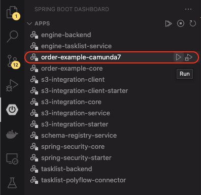

# Run the Application

If you follow the steps on [how to set up the development environment](setup-project.md#2-install-vs-code-plugins) you have VS Code with the *Spring Boot Dashboard* as a plugin installed.
If not, please do so now.

With the plugin installed, it is easy to run the application.

1. Switch to the *Spring Boot Dashboard View*
2. Run `order-example-camunda7`

    

## What's next?

Now everything is up and running.
Now you can go [back](../README.md#getting-started) and follow the instruction in step 8.
