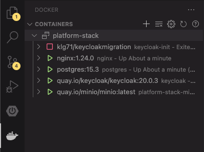

# Setup **Miranum Platform**

Clone the [GitHub Repository](https://github.com/Miragon/miranum-platform).

```shell
git clone https://github.com/Miragon/miranum-platform.git
```

If you want to use the version which we used for the showcase

```shell
git checkout b61b3b3599f0979850d39f27d74cf0046c348fc8
```

## Start Docker Compose

> Note: It is often the case that the `Keycloak` container fails at the first time. If this is the case, restart docker compose.

If the Container is up and running, you can confirm it by opening your browser and visit `localhost:8081`.
You can use the following credentials for login:

```text
user: alex
password: test
```

### ... with Command Line

```shell
cd miranum-platform/platform-stack
docker compose --profile engine up
```

### ... with VS Code

1. Install the [Docker Plugin](https://marketplace.visualstudio.com/items?itemName=ms-azuretools.vscode-docker)
2. Open the repository in VS Code as a separate workspace (`File > Add Folder to Workspace...`)
3. Open the *Command Palette* (`View > Command Palette`)
4. Enter `Docker: Compose Up - Select Services`
5. Select `miranum-platform` from the displayed list
6. Select `Profiles`
7. Select `engine` (if not already selected) and click on `OK`
8. Switch to the `Docker View` to manage the container

    

#### Best Practice

If you need to run Docker Compose frequently, we recommend overriding the default `docker compose` command or adding custom tasks.

##### Add Custom Tasks

1. Create a `.vscode` folder inside the `miranum-platform` folder
2. Add `tasks.json` to the folder
3. Paste the following JSON into that file:

    ```json
    {
    "version": "2.0.0",
    "tasks": [
        {
        "label": "Run docker-compose up",
        "type": "docker-compose",
        "dockerCompose": {
            "up": {
            "detached": true,
            "profiles": [
                "engine"
            ]
            },
            "files": [
            "${workspaceFolder}/platform-stack/docker-compose.yml",
            ]
        },
        "problemMatcher": []
        },
        {
        "label": "Run docker-compose down",
        "type": "docker-compose",
        "dockerCompose": {
            "down": {
            "customOptions": "--remove-orphans"
            },
            "files": [
            "${workspaceFolder}/platform-stack/docker-compose.yml",
            ]
        },
        "problemMatcher": []
        }
    ]
    }
    ```

4. Open the *Command Palette* (`View > Command Palette`)
5. Enter `Tasks: Run Task`
6. Enter `docker-compose`
7. Select the task you want to run

##### Override Default Command

1. Save your current Workspace (`File > Save Workspace As...`)
2. Open the Workspace Settings
    * Open the *Command Palette* (`View > Command Palette`)
    * Enter `Preferences: Open Workspace Settings`
    * Click on the icon  on the top right corner
3. Add the following:

    ```json
    {
        // ...
        "settings": {
            "docker.commands.composeUp": [
                {
                    "label": "Compose Up",
                    "template": "docker compose ${configurationFile} ${profileList} up ${detached}"
                }
            ],
            "docker.commands.composeDown": [
                {
                    "label": "Compose Down",
                    "template": "docker compose ${configurationFile} down --remove-orphans"
                }
            ]
        }
        // ...
    }
    ```

4. Right-Click on `/platform-stack/docker-compose.yml` and select `Compose Up`

> Note: If you don't want to get asked for the profile every time you can replace `${profileList}` form the JSON above with `engine`.

## What's next?

Now that **Miranum Platform** is up and running,
we are ready to deploy our Process Artifacts in the [next step](./deploy-artifacts.md).
