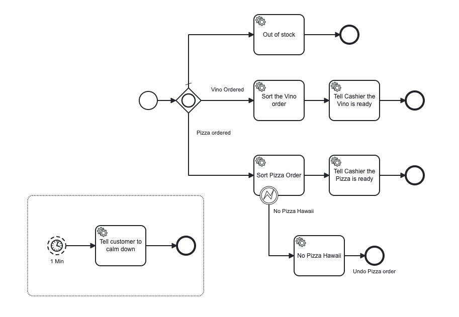
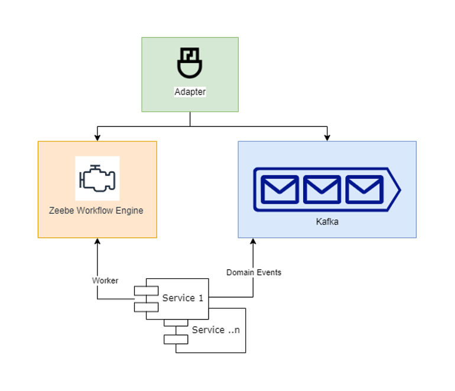

# Pizza e Vino
This is an example of how to decouple dependent microservices by adding Camunda Platform 8 as a dependency.
It was forked from [Thomas Heinrichs: Pizza e Vino Repository](https://github.com/Hafflgav/pizza-e-vino).

In total there are three services:
* a ``checkout``, where you can make orders to 
* a ``service`` that is responsible for serving food and drinks
* and a ``cooking`` service if a pizza needs to be made.

There are two versions of this architecture
 * **Synchronous:** All communication between services is completed in one transaction per request.
 * **Asynchronous:** Each request is persisted and completed in a new transaction while waiting for the potential of additional requests.
This is manifested in the two different versions of our service. (Sync & Async)

## Run the project 
1. Start the Checkout service in order to access the order frontend via ``http://localhost:8082`` 
2. Start the Cooking service
3. Either boot up Service-Sync or Service2-Async dependent on the architecture you want to run. 
    - If you decide to run the Async example make you have a Camunda Platform 8 Cluster up and running. Either SaaS or on-premise 
    - Update the Zeebe related properties in the [application.yaml](service-async/src/main/resources/application.yaml)

Now you can start a new order by filling out the form via the Checkout Service. Provide a ``pizza`` dish and some type of ``vino``. 
Make sure to use these keywords. An example of this is shown in the picture below. 

Now you are able to see the progress of your order in the console of each of the services. 
If you are running the asynchronous example you can also open up [Operate](https://docs.camunda.io/docs/components/operate/userguide/basic-operate-navigation/) 
in Camunda Platform 8 to visualise how the order progresses through the process.

## About the Process
We use BPMN 2.0 to visualise the workflow modelled with Camunda Platform 8. It is used in the asynchronous example and can be found in the 
[ressource folder](service-async/src/main/resources/howAreYou.bpmn). 

The process starts after the order has been submitted by the checkout service. Depending on what is ordered, vino or pizza, we split or continue 
the flow accordingly in the inclusive Gateway. After the Service components sorts the vino and pizza order. The latter is triggering the cooking 
service. Though we do not serve Pizza Hawaii and throw a BPMN Error if someone orders it. 

Once the order is sorted we are going to tell the cashier / waiter that it is ready. If the order fulfillment takes longer than 1 minute we are
going to tell checkout to calm down the customer.

## What's next? 
Of course there is further potential in this example. An immediate next step would be to add Kafka to the equation. Instead of communicating through REST 
our services could throw "Domain Events" and interpret them. A simple sketch of this architecture can be found in the picture below. 

Last but not least we can implement each of our services in such a way that they are technology neutral. Featuring in and out adapters and hexagonal 
architecture so our domain is a free as even possible. This concept is what [Miranum](https://miranum.com) is all about. Once it is release as a maven 
dependency it will be worth trying it out and refactoring our code accordingly. 
