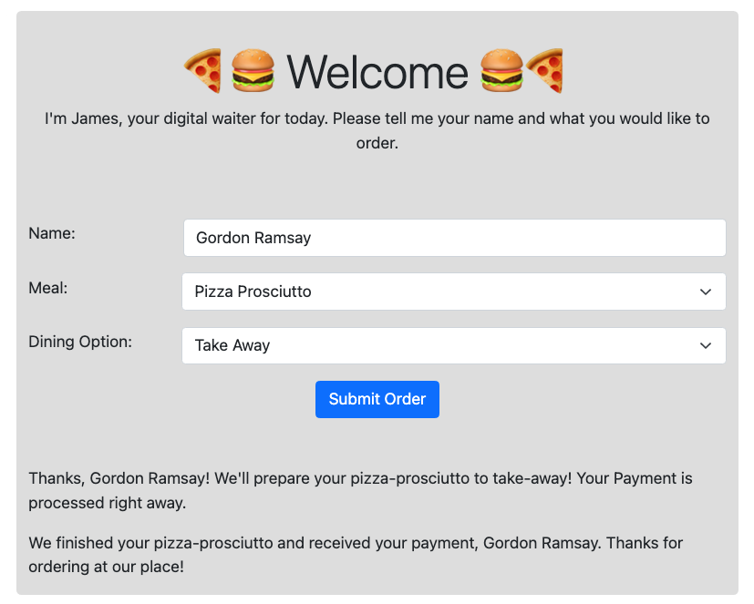
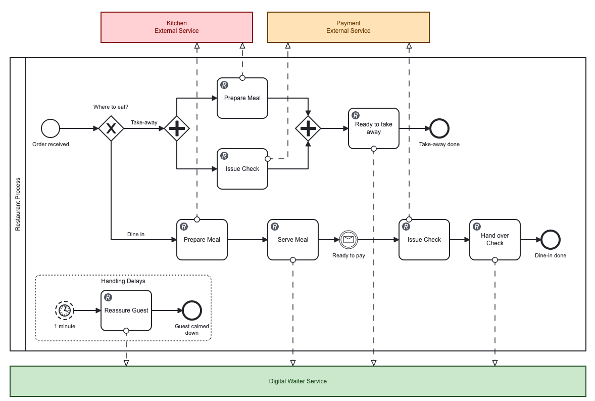
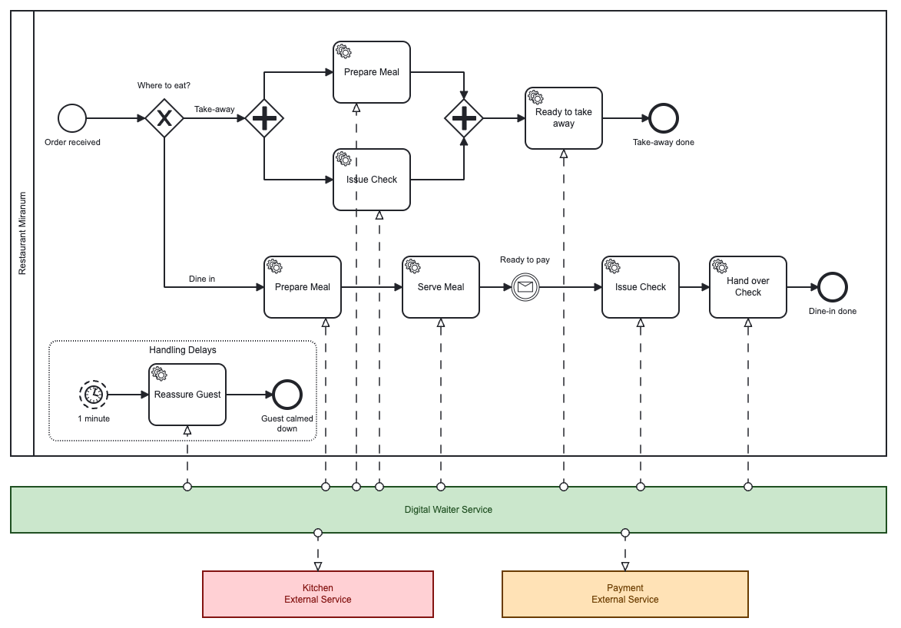
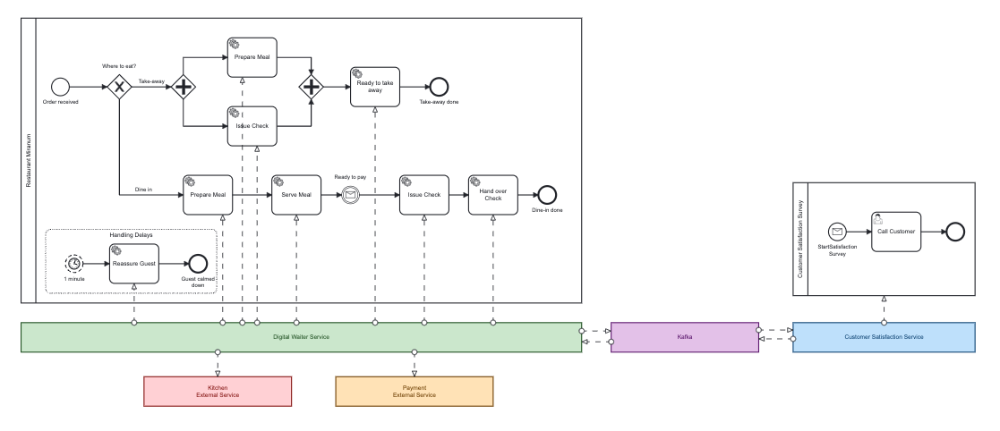

# Restaurant Showcase
This project showcases a good and a bad example of how to use Camunda 8 orchestrating microservices.
In the example the restaurants customer orders food via a web interface. The basic process involves a waiter, a kitchen and a payment service.

The kitchen and payment service are closed external services and a waiter team in part of the restaurant organisation, which is responsible to implement the workflow.



## 1. Bad Example
In a first approach the waiter team designed a bpmn process and uses Camunda 8 Rest Connectors to call the services.


### 1.1 Run
Follow these steps to run the example:
1. Start the docker services:
    ```
    docker-compose -f stack/docker-compose.yml up -d
    ```
2. Deploy the bpmn process to Camunda 8:
    Open Camunda Modeller and deploy the process model `waiter-plain/src/main/resources/restaurant-plain.bpmn`
3. Start the applications: `waiter-plain`, `restaurant` and `kitchen`

### 1.2 Problems
In production the waiter team is facing the following issues:
- Having technical aspects in the bpmn process model, like HTTP Method, URL, Body, etc. a new version of the model needs to be deployed, if the endpoint changes. (separation of concerns) 
- Calling the external services directly, the model is dependent on those. Switching to another provider is not possible without updating the model.
- The connectors drive the need for a larger dataset flowing in the scope of the process. They are parameterized in such a way that all information used by the connectors needs to be in the process. 

## 2. Good Example
Together with the Miragon consultants, the waiter team designed a new bpmn process, to address those issues.
The new architecture is based on the following principles:
- Avoid technical aspects in bmpn models by using External Tasks.
- Usage of Domain Driven Design and a Hexagonal Architecture to implement adapters for external services. That makes it easy to switch from one provider to another without changing th domain.
- Avoid boilerplate code by using Miranum Connect to communicate with Camunda.



### 2.1 Run
Shut down `waiter-plain` and start `waiter-miranum`.

### 2.2 Further Improvements
After the refactoring, the restaurant was so successful, that they had more resources.
They decided to set up a new team, which is now responsible for the customer satisfaction.
Using a message broker like kafka allows both teams to work independently and communicate over Domain Events.

